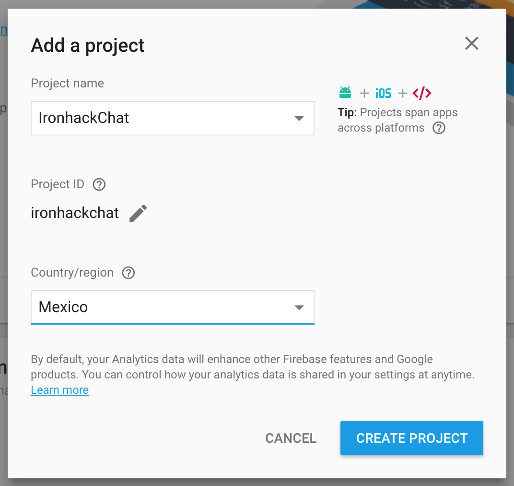
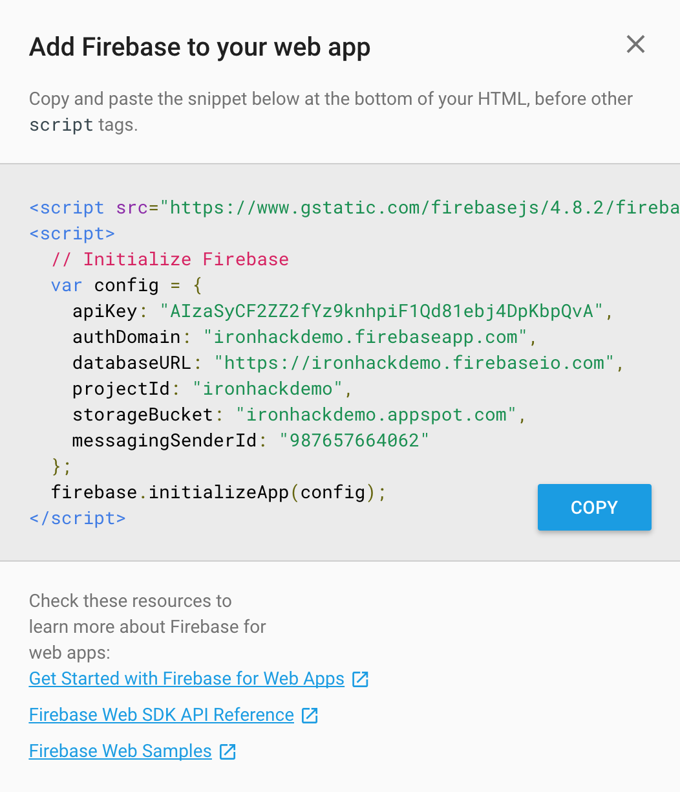

# Make a chat in no time!

## Learning Goals
After this lesson, you will be able to:

* Understand the importance of a backend
* To use serverless services for rapid development
* How to use Firebase database
* Use jQuery for make interactive web pacges
* How to publish a webApp

### Requirements
* [Fork this repo](https://guides.github.com/activities/forking/)
* Clone this repo into your `~/ironhack/` folder
* make sure you have chorme web browser installed

### Submission
Upon completion, run the following commands

```
$ git add .
$ git commit -m "done"
$ git push origin master
```

Navigate to your repo and create a Pull Request -from your master branch to the original repository master branch.

In the Pull request name, add your name and last names separated by a dash "-"

### Deliverables
The starter-code provides every resource you need to style your Chat. Please, push every thing you need to make it work properly on GitHub before creating the pull request.

## Introduction: How hard is to develop a backend?

We have heard about servers, databases, security, may be we've heard about devOps or hostings, heard that if you want to make any website you need a server, you need to be concern about the safety of your data, and we also have heard that to manage a database is hard, is complicated and troubleling, that you need an expert on datascience or backend to ensure your data will be secure, and if you want to learn to make all this we mention you need to be a nerd or some kind of super human and invest several years to learn all the stuff needed to become a backend developer.

And it's true. )=


But wait, we live in the tech era right?, we have seen all this awesome apps everywhere, this spectacular companies like Google that have been release alot of software to make our lives easier right? there is a lot of companies and startups making amazing products that are very techy, for example shazam this company has develop an app that can identify music, movies, advertising, and television shows, based on a short sample played and using the microphone on the device.
In just one year the Shazam app had more than 100 million monthly active users, and on December 11 of 2017 Shazam was bought by Apple inc and we think: there must be really hard to make an app like this.

 

But the truth, today there is many tools to accelerate your success, and we can make a very powerfull app with very little effort. Why we use Shazam as an example?,  you will see...

## Connect our App to a Firebase Project

We are going to use Firebase, Firebase is a backend as a service is one of the Google's tools in the Cloud, and it offers a lot of options to connect our webapps or mobile apps to services in the cloud, services that are a substitution of things you normally need a server (computer in some place in the world), with a backend written in any languaje conditioning for serves like PHP, RUBY, PYTHON, JAVA, C#, GO or many others.

### Create the Firebase Project

* Enter to the [Firebase console](console.firebase.google.com) make sure that you have logged in with any gmail account.
* Click in the "Add Project" button and set a cool name like "IronhackChat" and choose your country
 
* Enter to your brand new firebase project and copy the snipet for web app

* Finally we will navigate to our web app and will paste the firebase snipet into our `index.html` file in line 18, this file is inside our `starter_code` folder

## Analize the boilerplate

Open the project folder with sublime text and enter into the `starter_code` folder, once you see all the files, open the index.html and analize the pieces in it.
There are 3 main pieces.

## 
 


 

## 
